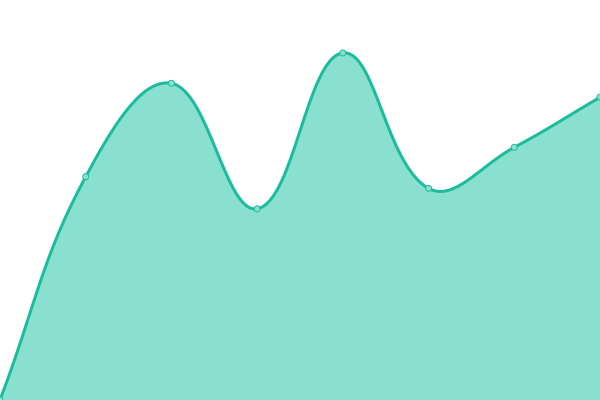

# [📈 Live Status](https://adtpdn.github.io/status): <!--live status--> **🟩 All systems operational**

This repository contains the open-source uptime monitor and status page for [adtpdn](https://adtpdn.github.io/status)

We use [Issues](https://github.com/adtpdn/status/issues) as incident reports, [Actions](https://github.com/adtpdn/status/actions) as uptime monitors, and [Pages](https://adtpdn.github.io/status) for the status page.

<!--start: status pages-->
<!-- This summary is generated by Upptime (https://github.com/upptime/upptime) -->
<!-- Do not edit this manually, your changes will be overwritten -->
<!-- prettier-ignore -->
| URL | Status | History | Response Time | Uptime |
| --- | ------ | ------- | ------------- | ------ |
|  [adengroup.com](adengroup.com) | 🟩 Up | [adengroup-com.yml](https://github.com/adtpdn/status/commits/HEAD/history/adengroup-com.yml) | 

 1219ms
     
 | 

<a href="https://adtpdn.github.io/status/history/adengroup-com">100.00%</a>
    

|  [adenenergies.com](adenenergies.com) | 🟩 Up | [adenenergies-com.yml](https://github.com/adtpdn/status/commits/HEAD/history/adenenergies-com.yml) | 

 1053ms
     
 | 

<a href="https://adtpdn.github.io/status/history/adenenergies-com">100.00%</a>
    

|  [nx-park.com](https://www.nx-park.com) | 🟩 Up | [nx-park-com.yml](https://github.com/adtpdn/status/commits/HEAD/history/nx-park-com.yml) | 

 2058ms
     
 | 

<a href="https://adtpdn.github.io/status/history/nx-park-com">100.00%</a>
    

|  [akila3d.com](https://www.akila3d.com/) | 🟩 Up | [akila3d-com.yml](https://github.com/adtpdn/status/commits/HEAD/history/akila3d-com.yml) | 

 2129ms
     
 | 

<a href="https://adtpdn.github.io/status/history/akila3d-com">100.00%</a>
    

<!--end: status pages-->

[**Visit our status website →**](https://adtpdn.github.io/status)

## 📄 License

- Powered by: [Upptime](https://github.com/upptime/upptime)
- Code: [MIT](./LICENSE) © [Anand Chowdhary](https://anandchowdhary.com), supported by [Pabio](https://pabio.com)
- Data in the `./history` directory: [Open Database License](https://opendatacommons.org/licenses/odbl/1-0/)
